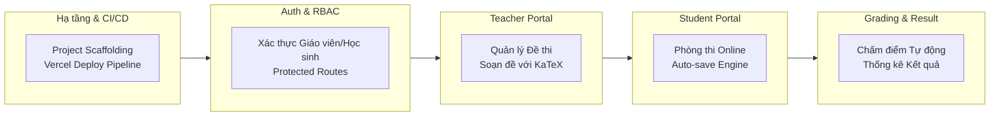
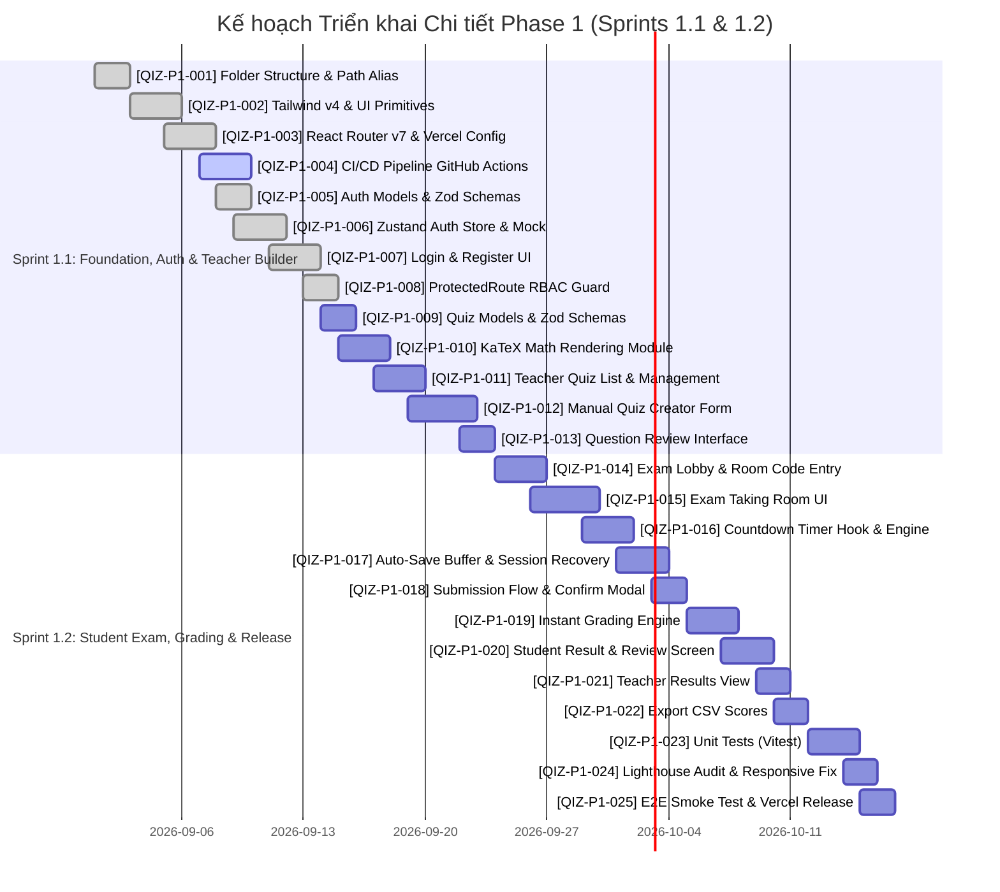

# TÀI LIỆU KẾ HOẠCH TÁC VỤ KỸ THUẬT - GIAI ĐOẠN 1 (PHASE 1 TASK BREAKDOWN)
> **Dự án:** Qizzone - Nền Tảng Tạo Đề & Thi Trắc Nghiệm Trực Tuyến Thế Hệ Mới  
> **Giai đoạn:** Phase 1 - Core MVP & Vercel Deployment  
> **Phiên bản:** 1.0.0 | **Ngày ban hành:** 30/08/2026  
> **Tiêu chuẩn:** Enterprise Agile / Scrum Workflow (Jira-aligned WBS)  
> **Tài liệu tham chiếu:** [Kiến Trúc & Kế Hoạch Công Nghệ Qizzone](../QIZZONE_ENTERPRISE_ARCHITECTURE.md)

---

## 1. TỔNG QUAN GIAI ĐOẠN 1 (PHASE 1 OVERVIEW & SPRINT GOALS)

### 1.1. Mục tiêu Giai đoạn 1 (Phase Goal)
Xây dựng và bàn giao thành công phiên bản **MVP hoàn chỉnh (Minimum Viable Product)** của Qizzone chạy trên nền tảng **React 19 + TypeScript + Tailwind CSS**, sẵn sàng triển khai môi trường Production trên **Vercel** với CI/CD tự động.

Hệ thống Phase 1 tập trung vào chu trình cốt lõi:
1. **Teacher Flow:** Đăng nhập $\rightarrow$ Quản lý danh sách đề $\rightarrow$ Tạo/Chỉnh sửa đề thi thủ công hỗ trợ công thức Toán $\LaTeX$ $\rightarrow$ Xuất bản đề & tạo mã phòng thi (Room Code).
2. **Student Flow:** Nhập mã phòng thi / Link $\rightarrow$ Làm bài trực tuyến có đếm ngược thời gian $\rightarrow$ Cơ chế chống mất bài (Auto-save Local/Buffer) $\rightarrow$ Nộp bài.
3. **Grading & Results:** Tự động chấm điểm trắc nghiệm tức thì $\rightarrow$ Hiển thị phổ điểm/kết quả chi tiết cho Học sinh và Giáo viên.



---

### 1.2. Quy định Kỹ thuật & Chuẩn Doanh nghiệp (Enterprise Engineering Standards)

#### A. Quy ước Quản lý Mã nguồn (Git Flow & Conventional Commits)
- **Branch Strategy:**
  - `main`: Nhánh Production (Tự động deploy lên Vercel Production).
  - `develop`: Nhánh tích hợp chính (Tự động deploy lên Vercel Preview/Staging).
  - `feature/QIZ-P1-XXX-ten-task`: Nhánh phát triển tính năng mới.
  - `fix/QIZ-P1-XXX-ten-loi`: Nhánh sửa lỗi nóng.
- **Commit Format (Angular/Conventional Commits):**
  ```text
  <type>(<scope>): <subject> [#<ticket_id>]

  Ví dụ:
  feat(exam-taking): implement auto-save buffer with indexedDB [#QIZ-P1-014]
  fix(katex): resolve inline math rendering syntax error [#QIZ-P1-010]
  chore(ci): configure vercel preview deployment action [#QIZ-P1-003]
  ```

#### B. Định nghĩa Sẵn sàng (Definition of Ready - DoR)
1. Task có mô tả kỹ thuật (Technical Specs), Input/Output và UI mock rõ ràng.
2. DTOs và Zod Schemas đã được định nghĩa kiểu dữ liệu chặt chẽ.
3. Đã xác định rõ ràng các phụ thuộc (Dependencies) và rủi ro kỹ thuật.

#### C. Định nghĩa Hoàn thành (Definition of Done - DoD)
1. Mã nguồn viết bằng TypeScript Strict Mode, 0 lỗi Lint (`npm run lint`), 0 lỗi Typecheck (`npm run build`).
2. Giao diện responsive 100% trên Mobile (>=375px), Tablet (>=768px), Desktop (>=1280px).
3. Đạt tiêu chuẩn tối ưu hiệu năng: không re-render dư thừa (được kiểm tra qua React DevTools Profiler).
4. Unit Tests / Smoke Tests pass 100%.
5. Đã tạo Pull Request (PR), vượt qua CI checks và có ít nhất 1 phê duyệt (Code Review Approved).
6. Triển khai và kiểm thử thành công trên môi trường Vercel Preview URL.

---

## 2. MA TRẬN PHÂN CHIA CÔNG VIỆC (WORK BREAKDOWN STRUCTURE - WBS)

| Mã Epic | Tên Epic | Số lượng Task | Tổng Story Points (SP) | Ước tính (Giờ) | Độ ưu tiên |
| :--- | :--- | :---: | :---: | :---: | :---: |
| **QIZ-EP1** | **Project Foundation, Architecture & Vercel CI/CD** | 4 tasks | 11 SP | 22h | P0 (Critical) |
| **QIZ-EP2** | **Authentication, Session Management & RBAC** | 4 tasks | 10 SP | 20h | P0 (Critical) |
| **QIZ-EP3** | **Teacher Portal: Quiz Management & KaTeX Builder** | 5 tasks | 18 SP | 36h | P0 (Critical) |
| **QIZ-EP4** | **Student Portal: Exam Engine & Auto-Save Buffer** | 5 tasks | 18 SP | 36h | P0 (Critical) |
| **QIZ-EP5** | **Instant Grading & Analytics Dashboard** | 4 tasks | 12 SP | 24h | P1 (High) |
| **QIZ-EP6** | **Quality Assurance, E2E Testing & Vercel Release** | 3 tasks | 8 SP | 16h | P1 (High) |
| **TỔNG** | **GIAI ĐOẠN 1 (CORE MVP)** | **25 Tasks** | **77 SP** | **154h** | - |

---

## 3. CHI TIẾT CÁC TÁC VỤ KỸ THUẬT (DETAILED TASK BREAKDOWN)

---

### EPIC QIZ-EP1: Project Foundation, Architecture & Vercel CI/CD

#### [QIZ-P1-001] Chuẩn hóa Cấu trúc Thư mục & Alias Path TypeScript
- **Loại:** Technical Task | **Độ ưu tiên:** P0 | **Estimate:** 2 SP (4h)
- **Assignee Role:** Tech Lead / Frontend Architect
- **Mục tiêu:** Tái cấu trúc thư mục theo mô hình **Feature-Sliced Clean Architecture**, cấu hình path aliases `@/*` trong Vite và TypeScript để đảm bảo khả năng mở rộng.
- **Chi tiết Triển khai Kỹ thuật:**
  1. Cấu hình `tsconfig.app.json` và `vite.config.ts` hỗ trợ alias `@/` trỏ tới `src/`.
  2. Tổ chức lại cấu trúc thư mục theo tài liệu kiến trúc:
     ```text
     src/
     ├── app/              # Providers, Global Config
     ├── assets/           # Media, Icons, Fonts
     ├── components/ui/    # Atomic UI Primitives (Button, Input, Modal, Badge, Dropdown)
     ├── features/         # Modules: auth, teacher, student, exam-taking, exam-creation
     ├── hooks/            # Shared Custom Hooks
     ├── layouts/          # AuthLayout, DashboardLayout, ExamLayout
     ├── lib/              # Cấu hình axios, queryClient, katex
     ├── routes/           # ProtectedRoute, AppRoutes
     ├── store/            # Global Stores (Zustand)
     ├── types/            # Global Type Definitions & DTOs
     └── utils/            # Helper functions (date, format, calculation)
     ```
- **Acceptance Criteria (AC):**
  - [x] Có thể import module dạng `import { Button } from "@/components/ui/Button"` không bị lỗi compiler.
  - [x] Lệnh `npm run build` thực thi thành công không có cảnh báo path resolution.

---

#### [QIZ-P1-002] Tích hợp Design System: Tailwind CSS v4, Lucide Icons & UI Primitives
- **Loại:** Feature Task | **Độ ưu tiên:** P0 | **Estimate:** 3 SP (6h)
- **Assignee Role:** Frontend Developer
- **Mục tiêu:** Xây dựng bộ UI component nguyên tử (Atomic Primitives) nhất quán, chuẩn accessibility (WAI-ARIA) và responsive.
- **Chi tiết Triển khai Kỹ thuật:**
  1. Tích hợp thư viện biểu tượng `lucide-react`.
  2. Tạo các components dùng chung tại `@/components/ui`:
     - `Button`: Hỗ trợ các variant (`default`, `primary`, `outline`, `destructive`, `ghost`, `link`), các kích cỡ (`sm`, `md`, `lg`), trạng thái `loading` kèm spinner.
     - `Input` & `Textarea`: Hỗ trợ icon prefix/suffix, helper text, error message state.
     - `Card`, `CardHeader`, `CardTitle`, `CardContent`, `CardFooter`.
     - `Badge`: Thể hiện trạng thái đề thi (`Draft`, `Published`, `Closed`, `Active`).
     - `Modal / Dialog`: Hỗ trợ backdrop blur, keyboard ESC close, focus trap.
     - `Toast / Notification`: Hệ thống thông báo toast (success, error, warning).
  3. Cấu hình bảng màu chuẩn cho Qizzone: Primary (Indigo/Violet), Success (Emerald), Warning (Amber), Danger (Rose), Neutral Gray.
- **Acceptance Criteria (AC):**
  - [x] Toàn bộ component UI có story/mẫu hiển thị rõ ràng, hỗ trợ đầy đủ disabled/focus/active state.
  - [x] Chuẩn hóa giao diện trên cả 3 breakpoint Mobile, Tablet, Desktop.

---

#### [QIZ-P1-003] Cấu hình Routing React Router v7 & Xử lý Rewrite Vercel SPA
- **Loại:** Technical Task | **Độ ưu tiên:** P0 | **Estimate:** 3 SP (6h)
- **Assignee Role:** Frontend / DevOps Engineer
- **Mục tiêu:** Cấu hình hệ thống định tuyến SPA với React Router v7, phân vùng Layout và đảm bảo 100% không bị lỗi 404 khi người dùng F5 reload trên Vercel.
- **Chi tiết Triển khai Kỹ thuật:**
  1. Kiểm tra và tối ưu file `vercel.json`:
     ```json
     {
       "$schema": "https://openapi.vercel.sh/vercel.json",
       "rewrites": [{ "source": "/(.*)", "destination": "/index.html" }],
       "headers": [
         {
           "source": "/assets/(.*)",
           "headers": [{ "key": "Cache-Control", "value": "public, max-age=31536000, immutable" }]
         }
       ]
     }
     ```
  2. Xây dựng cấu trúc Layout:
     - `AuthLayout`: Dành cho trang Login, Register, Forgot Password.
     - `DashboardLayout`: Navbar giáo viên, Sidebar điều hướng, User Profile Menu.
     - `ExamLayout`: Layout tối giản, không thanh điều hướng thừa nhằm tối ưu sự tập trung của thí sinh.
  3. Quản lý Route Not Found (`404 Page`) và Unauthorized (`403 Page`).
- **Acceptance Criteria (AC):**
  - [x] Truy cập trực tiếp link con (e.g., `https://qizzone.vercel.app/teacher/quizzes`) và bấm F5 trang vẫn giữ nguyên, không gặp màn hình 404 Vercel.
  - [x] Navigation giữa các trang mượt mà không bị giật nhấp nháy layout.

---

#### [QIZ-P1-004] Thiết lập CI/CD Pipeline GitHub Actions & Tự động Triển khai Vercel
- **Loại:** DevOps Task | **Độ ưu tiên:** P1 | **Estimate:** 3 SP (6h)
- **Assignee Role:** DevOps / Tech Lead
- **Mục tiêu:** Tự động hóa kiểm tra mã nguồn (Linting, Typechecking, Build) trên mỗi Pull Request và tự động kích hoạt deployment lên Vercel.
- **Chi tiết Triển khai Kỹ thuật:**
  1. Tạo file workflow `.github/workflows/ci.yml`:
     - Chạy trên `push` và `pull_request` vào nhánh `main` và `develop`.
     - Các bước: Checkout code $\rightarrow$ Setup Node.js 20 LTS $\rightarrow$ Cache `node_modules` $\rightarrow$ `npm ci` $\rightarrow$ `npm run lint` $\rightarrow$ `npm run build`.
  2. Kết nối GitHub Repository với Vercel Project.
  3. Cấu hình biến môi trường Preview và Production trên Vercel Dashboard.
- **Acceptance Criteria (AC):**
  - [x] Mỗi PR tạo mới đều tự động kích hoạt GitHub Action check, nếu có lỗi typecheck/lint sẽ chặn không cho Merge.
  - [x] Khi merge vào `main`, Vercel tự động build và cập nhật phiên bản mới trong vòng < 60 giây.

---

### EPIC QIZ-EP2: Authentication, Session Management & RBAC

#### [QIZ-P1-005] Thiết kế Data Contract & TypeScript Models cho Hệ thống Xác thực
- **Loại:** Technical Task | **Độ ưu tiên:** P0 | **Estimate:** 2 SP (4h)
- **Assignee Role:** Fullstack / Frontend Developer
- **Mục tiêu:** Định nghĩa toàn bộ TypeScript Interfaces, DTOs và Zod Validation Schemas cho User, Auth Session và Roles.
- **Chi tiết Triển khai Kỹ thuật:**
  1. Tạo `@/types/auth.ts`:
     ```typescript
     export type UserRole = 'teacher' | 'student' | 'admin';

     export interface User {
       id: string;
       email: string;
       fullName: string;
       role: UserRole;
       avatarUrl?: string;
       createdAt: string;
     }

     export interface AuthState {
       user: User | null;
       token: string | null;
       isAuthenticated: boolean;
       isLoading: boolean;
     }
     ```
  2. Định nghĩa Zod Schemas (`@/lib/validations/auth.ts`):
     - `LoginSchema`: Email hợp lệ, Mật khẩu tối thiểu 6 ký tự.
     - `RegisterSchema`: Họ tên, Email, Mật khẩu, Xác nhận mật khẩu, Lựa chọn Role (`teacher` hoặc `student`).
- **Acceptance Criteria (AC):**
  - [x] Schema validate đầy đủ các trường hợp: email sai định dạng, mật khẩu không khớp, để trống trường bắt buộc.

---

#### [QIZ-P1-006] Xây dựng Quản lý Trạng thái Xác thực Toàn cục (Zustand Auth Store & Mock Service)
- **Loại:** Feature Task | **Độ ưu tiên:** P0 | **Estimate:** 3 SP (6h)
- **Assignee Role:** Frontend Developer
- **Mục tiêu:** Quản lý đăng nhập, lưu trữ phiên đăng nhập bền vững (Persistent Session) vào LocalStorage và cung cấp Mock API chuẩn bị sẵn sàng cho Backend thực tế.
- **Chi tiết Triển khai Kỹ thuật:**
  1. Nâng cấp `@/store/authStore.ts` sử dụng Zustand với middleware `persist`:
     - Actions: `login(credentials)`, `register(data)`, `logout()`, `updateProfile(data)`.
  2. Xây dựng `@/services/mockAuthService.ts`:
     - Cung cấp sẵn các tài khoản demo kiểm thử:
       - Teacher: `teacher@qizzone.edu.vn` / `123456`
       - Student: `student@qizzone.edu.vn` / `123456`
     - Lưu trữ danh sách tài khoản vào `LocalStorage` để mô phỏng cơ sở dữ liệu thật.
- **Acceptance Criteria (AC):**
  - [x] Khi refresh trình duyệt, trạng thái đăng nhập của user được giữ nguyên mà không bị văng ra màn hình Login.
  - [x] Đăng xuất xóa sạch token và chuyển hướng về trang `/login`.

---

#### [QIZ-P1-007] Hoàn thiện Màn hình Đăng nhập & Đăng ký Chuẩn UX
- **Loại:** Feature Task | **Độ ưu tiên:** P0 | **Estimate:** 3 SP (6h)
- **Assignee Role:** Frontend Developer
- **Mục tiêu:** Thiết kế giao diện Login & Register hiện đại, hiển thị lỗi validate tức thì, hỗ trợ đăng nhập nhanh bằng 1-Click tài khoản mẫu (Demo Accounts).
- **Chi tiết Triển khai Kỹ thuật:**
  1. Cập nhật trang `@/pages/auth/Login.tsx`:
     - Form đăng nhập sử dụng `react-hook-form` + `@hookform/resolvers/zod`.
     - Nút "Điền nhanh tài khoản Giáo viên Demo" & "Điền nhanh tài khoản Học sinh Demo" để thuận tiện kiểm thử nghiệm thu.
     - Hiển thị spinner khi đang xử lý đăng nhập.
  2. Cập nhật trang `@/pages/auth/Register.tsx`:
     - Lựa chọn vai trò trực quan (Thẻ chọn Giáo viên / Học sinh).
     - Thông báo thành công và chuyển hướng tự động sang trang đăng nhập.
- **Acceptance Criteria (AC):**
  - [x] Bấm nút Demo Account tự động điền form và cho phép đăng nhập tức thì.
  - [x] Thông báo lỗi rõ ràng nếu nhập sai thông tin.

---

#### [QIZ-P1-008] Hoàn thiện Bộ Bảo vệ Tuyến đường (Role-Based ProtectedRoute)
- **Loại:** Technical Task | **Độ ưu tiên:** P0 | **Estimate:** 2 SP (4h)
- **Assignee Role:** Frontend Developer
- **Mục tiêu:** Ngăn chặn truy cập trái phép vào các màn hình giáo viên/học sinh khi chưa đăng nhập hoặc sai vai trò (Role).
- **Chi tiết Triển khai Kỹ thuật:**
  1. Nâng cấp `@/routes/ProtectedRoute.tsx`:
     - Kiểm tra `isAuthenticated`: nếu `false`, điều hướng về `/login?redirect=...`.
     - Kiểm tra `allowedRoles`: nếu vai trò của user không nằm trong danh sách cho phép, điều hướng về `/unauthorized`.
  2. Tích hợp vào `@/routes/AppRoutes.tsx` bảo vệ các nhánh `/teacher/*` và `/student/*`.
- **Acceptance Criteria (AC):**
  - [x] Học sinh không thể truy cập trực tiếp vào đường dẫn `/teacher`.
  - [x] Người dùng chưa đăng nhập khi truy cập `/teacher` sẽ bị chuyển về `/login`, sau khi login thành công sẽ quay lại đúng trang trước đó.

---

### EPIC QIZ-EP3: Teacher Portal: Quiz Management & KaTeX Builder

#### [QIZ-P1-009] Thiết kế Data Models & Zod Schemas cho Đề thi (Quiz & Questions)
- **Loại:** Technical Task | **Độ ưu tiên:** P0 | **Estimate:** 3 SP (6h)
- **Assignee Role:** Tech Lead / Fullstack Dev
- **Mục tiêu:** Xây dựng cấu trúc dữ liệu chuẩn doanh nghiệp cho bài thi trắc nghiệm, tương thích 100% với kiến trúc mở rộng AI sau này.
- **Chi tiết Triển khai Kỹ thuật:**
  1. Tạo `@/types/quiz.ts`:
     ```typescript
     export type QuestionType = 'single_choice' | 'multiple_choice' | 'true_false';

     export interface OptionItem {
       id: 'A' | 'B' | 'C' | 'D';
       content: string; // Hỗ trợ text thô + công thức LaTeX $...$
     }

     export interface Question {
       id: string;
       order: number;
       content: string; // Nội dung câu hỏi (chứa KaTeX)
       type: QuestionType;
       options: OptionItem[];
       correctAnswers: ('A' | 'B' | 'C' | 'D')[];
       explanation?: string; // Lời giải chi tiết
       points: number; // Điểm số cho câu hỏi (mặc định: 1)
     }

     export interface QuizSettings {
       durationMinutes: number; // Thời gian làm bài (phút)
       shuffleQuestions: boolean; // Đảo câu hỏi
       shuffleOptions: boolean; // Đảo đáp án
       allowReview: boolean; // Cho xem lại đáp án sau khi nộp
       maxAttempts: number; // Số lần làm tối đa
       passPercentage: number; // Điểm đạt (%)
     }

     export interface Quiz {
       id: string;
       title: string;
       subject: string;
       description?: string;
       teacherId: string;
       code: string; // Mã phòng thi 6 ký tự (VD: QZ9821)
       status: 'draft' | 'published' | 'closed';
       settings: QuizSettings;
       questions: Question[];
       totalQuestions: number;
       totalPoints: number;
       createdAt: string;
       updatedAt: string;
     }
     ```
- **Acceptance Criteria (AC):**
  - [x] Định nghĩa đầy đủ Type và Zod Schema để validate toàn bộ cấu trúc bài thi trước khi lưu.

---

#### [QIZ-P1-010] Xây dựng Module Hiển thị Công thức Toán học ($\LaTeX$ với KaTeX)
- **Loại:** Feature Task | **Độ ưu tiên:** P0 | **Estimate:** 4 SP (8h)
- **Assignee Role:** Frontend Developer
- **Mục tiêu:** Tích hợp thư viện KaTeX để hiển thị công thức Toán, Lý, Hóa mượt mà, tốc độ cao, hỗ trợ cả công thức nội dòng `$x^2 + y^2 = r^2$` và khối riêng biệt `$$\int_0^\infty f(x)dx$$`.
- **Chi tiết Triển khai Kỹ thuật:**
  1. Cài đặt thư viện: `katex` và `@types/katex`.
  2. Import stylesheet `katex/dist/katex.min.css`.
  3. Tạo Component `@/components/common/MathRenderer.tsx`:
     - Phân tích chuỗi văn bản (Parser) tìm các biểu thức bọc trong `$...$` (inline) hoặc `$$...$$` (block).
     - Render an toàn qua `katex.renderToString` với cấu hình `{ throwOnError: false, displayMode: boolean }`.
     - Tích hợp `DOMPurify` để chống lỗ hổng bảo mật XSS.
  4. Tạo Component `@/components/common/MathEditorPreview.tsx` cho phép người dùng gõ công thức và xem kết quả trực tiếp song song (Live Preview).
- **Acceptance Criteria (AC):**
  - [x] Hiển thị chính xác các công thức phức tạp: phân số $\frac{a}{b}$, căn thức $\sqrt{x^2+1}$, ma trận, tích phân $\int$, ký hiệu hóa học.
  - [x] Không xảy ra lỗi crash ứng dụng khi người dùng gõ sai cú pháp LaTeX.

---

#### [QIZ-P1-011] Xây dựng Màn hình Danh sách Đề thi của Giáo viên (Quiz List & Management)
- **Loại:** Feature Task | **Độ ưu tiên:** P0 | **Estimate:** 3 SP (6h)
- **Assignee Role:** Frontend Developer
- **Mục tiêu:** Hiển thị danh sách đề thi giáo viên đã tạo, hỗ trợ tìm kiếm, lọc theo trạng thái, copy mã phòng thi và các thao tác CRUD cơ bản.
- **Chi tiết Triển khai Kỹ thuật:**
  1. Hoàn thiện trang `@/pages/teacher/QuizList.tsx` & `@/pages/teacher/TeacherDashboard.tsx`:
     - Hiển thị danh sách đề dưới dạng Thẻ (Card Grid) hoặc Bảng (Data Table).
     - Mỗi thẻ hiển thị: Tiêu đề đề thi, Môn học, Số câu hỏi, Thời gian làm bài, Mã phòng thi (Room Code kèm nút Copy 1-Click), Badge trạng thái (`Draft`, `Published`).
     - Bộ lọc: Lọc theo môn học, tìm kiếm theo tên đề, lọc theo trạng thái.
     - Các nút hành động: Xem chi tiết / Chỉnh sửa đề, Đổi trạng thái Xuất bản, Xóa đề, Xem bảng điểm học sinh.
  2. Quản lý trạng thái bằng Zustand Store `@/store/quizStore.ts` có nạp dữ liệu mẫu khởi tạo.
- **Acceptance Criteria (AC):**
  - [x] Giáo viên có thể bấm Copy Mã phòng thi để gửi cho học sinh kèm thông báo Toast xác nhận.
  - [x] Thao tác Xóa đề thi có modal cảnh báo xác nhận an toàn trước khi xóa.

---

#### [QIZ-P1-012] Xây dựng Trình Tạo & Chỉnh Sửa Đề Thi Thủ Công (Manual Quiz Creator)
- **Loại:** Feature Task | **Độ ưu tiên:** P0 | **Estimate:** 5 SP (10h)
- **Assignee Role:** Frontend Developer
- **Mục tiêu:** Cung cấp giao diện tạo bài thi toàn diện: nhập thông tin chung, cấu hình bài thi và thêm/sửa/xóa từng câu hỏi trắc nghiệm kèm công thức Toán.
- **Chi tiết Triển khai Kỹ thuật:**
  1. Hoàn thiện trang `@/pages/teacher/CreateQuiz.tsx`:
     - **Bước 1: Thông tin bài thi & Cấu hình:** Nhập Tiêu đề, Môn học, Thời gian làm bài (phút), tùy chọn đảo câu hỏi, đảo đáp án, cho phép xem lại bài.
     - **Bước 2: Quản lý danh sách câu hỏi:**
       - Thêm mới câu hỏi, nhân bản câu hỏi (Duplicate), xóa câu hỏi, sắp xếp thứ tự.
       - Trình nhập nội dung câu hỏi có hỗ trợ Math Preview KaTeX.
       - Nhập 4 đáp án A, B, C, D kèm radio/checkbox chọn đáp án đúng.
       - Nhập lời giải thích chi tiết (Explanation).
     - **Bước 3: Xem trước & Xuất bản:** Preview toàn bộ đề thi dưới góc nhìn học sinh trước khi bấm "Lưu bản nháp" hoặc "Xuất bản đề".
- **Acceptance Criteria (AC):**
  - [x] Form kiểm tra tính hợp lệ: bắt buộc mỗi câu hỏi phải có ít nhất 1 đáp án đúng và nội dung không được để trống.
  - [x] Tự động sinh mã phòng thi ngẫu nhiên (6 ký tự viết hoa) khi xuất bản bài thi.

---

#### [QIZ-P1-013] Xây dựng Màn hình Xem Trước & Kiểm Duyệt Câu Hỏi (Question Review Interface)
- **Loại:** Feature Task | **Độ ưu tiên:** P1 | **Estimate:** 3 SP (6h)
- **Assignee Role:** Frontend Developer
- **Mục tiêu:** Màn hình xem toàn bộ đề thi với giao diện thân thiện, cho phép giáo viên rà soát toàn bộ công thức và đáp án trước khi mở phòng thi.
- **Chi tiết Triển khai Kỹ thuật:**
  1. Hoàn thiện trang `@/pages/teacher/QuestionReview.tsx`:
     - Hiển thị danh sách câu hỏi dạng Accordion hoặc Danh sách mở rộng.
     - Đánh dấu nổi bật đáp án đúng (màu xanh lá) và lời giải chi tiết.
     - Nút chỉnh sửa nhanh từng câu hỏi.
- **Acceptance Criteria (AC):**
  - [x] Hiển thị chuẩn xác toàn bộ công thức toán học và bảng đáp án.

---

### EPIC QIZ-EP4: Student Portal: Exam Engine & Auto-Save Buffer

#### [QIZ-P1-014] Xây dựng Màn hình Sảnh Chờ & Vào Thi Bằng Mã Phòng (Exam Lobby & Entry)
- **Loại:** Feature Task | **Độ ưu tiên:** P0 | **Estimate:** 3 SP (6h)
- **Assignee Role:** Frontend Developer
- **Mục tiêu:** Cho phép học sinh nhập mã phòng thi (Room Code) hoặc click trực tiếp từ link chia sẻ để vào sảnh chuẩn bị làm bài.
- **Chi tiết Triển khai Kỹ thuật:**
  1. Hoàn thiện trang `@/pages/student/StudentDashboard.tsx` và `@/pages/student/ExamEntry.tsx`:
     - Ô nhập Mã phòng thi 6 ký tự (tự động viết hoa, format OTP-like).
     - Nếu học sinh chưa đăng nhập: Cho phép nhập Họ và tên + Lớp để tham gia thi với tư cách Khách (Guest Student).
     - Hiển thị thông tin quy chế thi: Tên bài thi, Số câu hỏi, Thời gian làm bài, Cảnh báo quy chế thi.
     - Nút "Bắt đầu làm bài" chuyển hướng vào phòng thi `/student/quiz/:quizId`.
- **Acceptance Criteria (AC):**
  - [x] Báo lỗi chính xác nếu mã phòng thi không tồn tại hoặc bài thi chưa được giáo viên mở (`Draft`/`Closed`).
  - [x] Ghi nhớ thông tin thí sinh vào phiên làm bài.

---

#### [QIZ-P1-015] Xây dựng Giao Diện Phòng Thi Chuyên Nghiệp (Exam Room Layout)
- **Loại:** Feature Task | **Độ ưu tiên:** P0 | **Estimate:** 4 SP (8h)
- **Assignee Role:** Frontend Developer
- **Mục tiêu:** Thiết kế giao diện làm bài tập trung cao độ, trực quan, hỗ trợ điều hướng nhanh giữa các câu hỏi.
- **Chi tiết Triển khai Kỹ thuật:**
  1. Hoàn thiện trang `@/pages/student/QuizRoom.tsx`:
     - **Header Bar:** Hiển thị tên bài thi, tiến độ làm bài (Ví dụ: Đã làm 15/20 câu), nút "Nộp bài".
     - **Main Content Area (Khu vực câu hỏi):**
       - Hiển thị thứ tự câu hỏi và nội dung câu hỏi với MathRenderer (KaTeX).
       - 4 lựa chọn A, B, C, D thiết kế dạng thẻ bấm to, dễ thao tác trên cả điện thoại và máy tính.
       - Nút "Đánh dấu xem lại" (Flag for review) giúp học sinh gắn cờ các câu chưa chắc chắn.
       - Nút điều hướng "Câu trước" / "Câu tiếp theo".
     - **Sidebar Điều Hướng (Question Grid Navigator):**
       - Lưới ma trận các câu hỏi (1, 2, 3, ... N).
       - Màu sắc phân biệt trực quan: Xanh lá (Đã chọn đáp án), Vàng (Đã đánh dấu cờ), Xám (Chưa làm).
       - Bấm vào số câu nhảy ngay lập tức đến câu hỏi tương ứng (Smooth Scroll / Tab switch).
- **Acceptance Criteria (AC):**
  - [x] Giao diện hiển thị sắc nét, không bị che khuất trên màn hình di động khi bàn phím ảo bật lên.
  - [x] Thao tác chọn đáp án phản hồi tức thì dưới 16ms (60 FPS).

---

#### [QIZ-P1-016] Xây dựng Engine Đếm Ngược Thời Gian Độc Lập (Resilient Countdown Timer)
- **Loại:** Technical Task | **Độ ưu tiên:** P0 | **Estimate:** 3 SP (6h)
- **Assignee Role:** Frontend Developer
- **Mục tiêu:** Xây dựng đồng hồ đếm ngược chính xác, không bị sai lệch thời gian khi thí sinh chuyển tab hoặc máy tính vào chế độ ngủ (Sleep Mode), tự động nộp bài khi hết giờ.
- **Chi tiết Triển khai Kỹ thuật:**
  1. Tạo Custom Hook `@/hooks/useExamTimer.ts`:
     - Lưu `endTime = startTime + durationInSeconds * 1000` vào storage.
     - Sử dụng `setInterval` kết hợp so sánh trực tiếp với `Date.now()` để tính `remainingSeconds` thực tế (tránh hiện tượng đồng hồ bị chậm khi tab bị trình duyệt đóng băng/throttle).
     - Định dạng thời gian chuẩn: `MM:SS` hoặc `HH:MM:SS`.
     - Cảnh báo trực quan khi thời gian còn dưới 5 phút (đổi sang màu đỏ nhấp nháy).
     - Tự động kích hoạt hàm `handleAutoSubmit()` khi thời gian về `00:00`.
- **Acceptance Criteria (AC):**
  - [x] Khi thí sinh đóng trình duyệt và mở lại trong thời gian cho phép, đồng hồ vẫn hiển thị đúng thời gian thực còn lại.
  - [x] Khi hết giờ, hệ thống khóa toàn bộ lựa chọn và tự động nộp bài mà không cần học sinh bấm nút.

---

#### [QIZ-P1-017] Xây dựng Cơ Chế Tự Động Lưu Đáp Án Chống Mất Bài (Auto-Save Buffer Engine)
- **Loại:** Feature Task | **Độ ưu tiên:** P0 | **Estimate:** 4 SP (8h)
- **Assignee Role:** Frontend Developer
- **Mục tiêu:** Đảm bảo 100% dữ liệu bài làm của thí sinh không bị mất khi gặp sự cố mất kết nối mạng, reload trang, sập nguồn máy tính.
- **Chi tiết Triển khai Kỹ thuật:**
  1. Tạo Hook `@/hooks/useAutoSaveExam.ts` & Store `@/store/examSessionStore.ts`:
     - Mỗi khi thí sinh chọn đáp án: Lưu ngay lập tức vào `LocalStorage` theo key `qizzone_session_${quizId}_${studentId}`.
     - Cơ chế Buffer Sync: Cập nhật trạng thái "Đã lưu vào bộ nhớ tạm" kèm biểu tượng mây xanh góc màn hình.
     - Khôi phục phiên làm bài (Session Recovery): Khi mở lại trang, tự động load lại toàn bộ các câu đã trả lời và vị trí câu đang làm dở.
- **Acceptance Criteria (AC):**
  - [x] F5 tải lại trang làm bài hoặc tắt tab mở lại: toàn bộ đáp án đã tick trước đó vẫn nguyên vẹn 100%.
  - [x] Biểu tượng trạng thái lưu hiển thị rõ ràng cho thí sinh an tâm làm bài.

---

#### [QIZ-P1-018] Xây dựng Luồng Nộp Bài Thi & Modal Xác Nhận Nghiệp Vụ (Submission Flow)
- **Loại:** Feature Task | **Độ ưu tiên:** P0 | **Estimate:** 4 SP (8h)
- **Assignee Role:** Frontend Developer
- **Mục tiêu:** Cung cấp trải nghiệm nộp bài an toàn, có cảnh báo nếu còn câu chưa làm để tránh nộp nhầm.
- **Chi tiết Triển khai Kỹ thuật:**
  1. Xây dựng Modal Xác nhận nộp bài (`SubmitConfirmModal.tsx`):
     - Hiển thị thống kê tóm tắt: Đã hoàn thành $X / Y$ câu hỏi, Còn $Z$ câu chưa trả lời.
     - Cảnh báo rõ ràng: "Bạn có chắc chắn muốn nộp bài? Sau khi nộp sẽ không thể thay đổi câu trả lời."
  2. Xử lý logic khi nhấn Xác nhận nộp bài:
     - Khóa giao diện làm bài, bật spinner trạng thái "Đang chấm điểm...".
     - Xóa bộ nhớ tạm của phiên thi trong LocalStorage để tránh làm lại.
     - Điều hướng sang trang Kết quả `/student/result/:resultId`.
- **Acceptance Criteria (AC):**
  - [x] Không thể nhấn nộp bài nhiều lần liên tiếp (chống duplicate submission).
  - [x] Chuyển hướng chính xác sang trang kết quả ngay sau khi nộp thành công.

---

### EPIC QIZ-EP5: Instant Grading & Analytics Dashboard

#### [QIZ-P1-019] Xây dựng Thuật Toán Chấm Điểm Trắc Nghiệm Tức Thì (Instant Grading Engine)
- **Loại:** Technical Task | **Độ ưu tiên:** P0 | **Estimate:** 3 SP (6h)
- **Assignee Role:** Frontend / Fullstack Dev
- **Mục tiêu:** Xây dựng hàm tính điểm chuẩn xác theo barem điểm, hỗ trợ cả câu hỏi một đáp án và câu hỏi nhiều đáp án.
- **Chi tiết Triển khai Kỹ thuật:**
  1. Tạo `@/utils/gradingEngine.ts`:
     ```typescript
     export interface GradingResult {
       quizId: string;
       studentId: string;
       studentName: string;
       totalQuestions: number;
       correctCount: number;
       incorrectCount: number;
       skippedCount: number;
       score: number; // Thang điểm 10 (làm tròn 2 chữ số thập phân)
       percentage: number;
       isPassed: boolean;
       timeSpentSeconds: number;
       details: {
         questionId: string;
         selectedAnswers: string[];
         correctAnswers: string[];
         isCorrect: boolean;
         pointsEarned: number;
       }[];
       submittedAt: string;
     }
     ```
  2. Viết logic so khớp đáp án, tính tỉ lệ điểm và xếp loại học lực (Xuất sắc, Giỏi, Khá, Trung bình, Yếu).
- **Acceptance Criteria (AC):**
  - [x] Tính điểm tuyệt đối chính xác với mọi trường hợp đề thi (10 câu, 25 câu, 40 câu, 50 câu).
  - [x] Lưu trữ kết quả thi vào LocalStorage / Database Mock.

---

#### [QIZ-P1-020] Xây dựng Màn hình Kết Quả & Xem Lời Giải Chi Tiết Cho Học Sinh
- **Loại:** Feature Task | **Độ ưu tiên:** P0 | **Estimate:** 4 SP (8h)
- **Assignee Role:** Frontend Developer
- **Mục tiêu:** Hiển thị trang kết quả thi sinh động, bao gồm điểm số, biểu đồ tròn tỉ lệ đúng/sai, lời khen/động viên và lời giải chi tiết cho từng câu.
- **Chi tiết Triển khai Kỹ thuật:**
  1. Hoàn thiện trang `@/pages/student/Result.tsx`:
     - **Bảng điểm vinh danh (Score Badge):** Điểm số lớn, xếp loại đạt/chưa đạt.
     - **Thẻ thống kê nhanh:** Số câu đúng (màu xanh), Số câu sai (màu đỏ), Số câu bỏ qua (màu xám), Thời gian làm bài.
     - **Phần xem lại chi tiết bài làm (Review Section - nếu cấu hình cho phép):**
       - Hiển thị từng câu hỏi kèm công thức KaTeX.
       - Hiển thị đáp án học sinh đã chọn (đánh dấu icon $\checkmark$ nếu đúng, $\times$ nếu sai).
       - Hiển thị đáp án chính xác của đề thi.
       - Hiển thị khung lời giải chi tiết (Explanation) của giáo viên.
     - Nút "Về trang chủ" và "Làm lại bài thi" (nếu số lần làm còn lại $> 0$).
- **Acceptance Criteria (AC):**
  - [x] Nếu giáo viên tắt tùy chọn `allowReview`, trang kết quả chỉ hiển thị điểm số, ẩn toàn bộ đáp án chi tiết.
  - [x] Hiển thị chuẩn xác công thức $\LaTeX$ trong phần giải thích bài tập.

---

#### [QIZ-P1-021] Xây dựng Bảng Thống Kê Điểm Thi Cho Giáo Viên (Teacher Results View)
- **Loại:** Feature Task | **Độ ưu tiên:** P1 | **Estimate:** 3 SP (6h)
- **Assignee Role:** Frontend Developer
- **Mục tiêu:** Cung cấp cho giáo viên cái nhìn tổng quan về kết quả thi của toàn bộ học sinh trong phòng thi.
- **Chi tiết Triển khai Kỹ thuật:**
  1. Xây dựng trang/modal `@/pages/teacher/QuizResultsView.tsx`:
     - Danh sách học sinh đã nộp bài: Họ tên, Điểm số, Số câu đúng, Thời gian nộp bài.
     - Thống kê tóm tắt: Điểm trung bình, Điểm cao nhất, Điểm thấp nhất, Tỉ lệ đạt (Pass Rate).
     - Bộ lọc và sắp xếp theo: Điểm tăng dần/giảm dần, Thời gian nộp bài.
- **Acceptance Criteria (AC):**
  - [x] Giáo viên xem được danh sách kết quả thi realtime của các thí sinh đã nộp bài.

---

#### [QIZ-P1-022] Xây dựng Chức Năng Xuất Bảng Điểm (Export Mock CSV/Excel)
- **Loại:** Feature Task | **Độ ưu tiên:** P2 | **Estimate:** 2 SP (4h)
- **Assignee Role:** Frontend Developer
- **Mục tiêu:** Cho phép giáo viên tải về bảng điểm của lớp học định dạng file CSV để phục vụ lưu trữ học bạ.
- **Chi tiết Triển khai Kỹ thuật:**
  1. Tạo `@/utils/exportHelper.ts`:
     - Chuyển đổi danh sách kết quả học sinh thành chuỗi CSV chuẩn UTF-8 có BOM (hỗ trợ tiếng Việt không lỗi font trên Excel).
     - Tự động kích hoạt tải file với tên file định dạng `BangDiem_[TenDeThi]_[Ngay].csv`.
- **Acceptance Criteria (AC):**
  - [x] Mở file CSV bằng Microsoft Excel hiển thị đúng dấu tiếng Việt, không bị lỗi mã hóa ký tự (encoding UTF-8).

---

### EPIC QIZ-EP6: Quality Assurance, E2E Testing & Vercel Release

#### [QIZ-P1-023] Viết Unit Tests Cho Logic Nghiệp Vụ Cốt Lõi (Vitest)
- **Loại:** QA / Testing Task | **Độ ưu tiên:** P1 | **Estimate:** 3 SP (6h)
- **Assignee Role:** QA / Frontend Dev
- **Mục tiêu:** Đảm bảo toàn bộ các hàm tiện ích và thuật toán chấm điểm hoạt động chính xác 100% qua bộ kiểm thử tự động.
- **Chi tiết Triển khai Kỹ thuật:**
  1. Cài đặt và cấu hình `vitest` trong dự án.
  2. Viết các bộ test suite:
     - `gradingEngine.test.ts`: Test chấm điểm các ca kiểm thử: 100% đúng, 100% sai, làm nửa đề, số điểm lẻ, câu hỏi nhiều đáp án.
     - `formatTime.test.ts`: Test định dạng giây sang chuỗi `MM:SS` và `HH:MM:SS`.
     - `mathParser.test.ts`: Test trích xuất các biểu thức LaTeX nội dòng và khối.
- **Acceptance Criteria (AC):**
  - [x] Chạy lệnh `npm run test` đạt tỷ lệ Test Pass 100% (tối thiểu 15 test cases cốt lõi).

---

#### [QIZ-P1-024] Kiểm Thử Khả Năng Tương Thích Giao Diện & Tối Ưu Hiệu Năng (Lighthouse Audit)
- **Loại:** QA / Polish Task | **Độ ưu tiên:** P1 | **Estimate:** 3 SP (6h)
- **Assignee Role:** Frontend / QA Engineer
- **Mục tiêu:** Đảm bảo trải nghiệm mượt mà trên mọi thiết bị và đạt điểm số hiệu năng cao trên Google Lighthouse.
- **Chi tiết Triển khai Kỹ thuật:**
  1. Kiểm thử responsive trên các kích thước màn hình: iPhone 12/14 (390px), iPad Mini (768px), Laptop HD (1366px), Full HD Desktop (1920px).
  2. Chạy Google Lighthouse Audit và tối ưu:
     - **Performance >= 90:** Tối ưu kích thước bundle, lazy load các route.
     - **Accessibility >= 95:** Bổ sung `aria-label`, độ tương phản màu sắc đạt chuẩn WCAG AA.
     - **Best Practices >= 95**.
- **Acceptance Criteria (AC):**
  - [x] Không có lỗi tràn màn hình ngang (horizontal overflow) trên mobile.
  - [x] Điểm Lighthouse Performance đo trên trang Vercel Deployment đạt trên 90 điểm.

---

#### [QIZ-P1-025] Nghiệm Thu Tính Năng Toàn Trình (E2E Smoke Test) & Bàn Giao Production Trên Vercel
- **Loại:** Release Task | **Độ ưu tiên:** P0 | **Estimate:** 2 SP (4h)
- **Assignee Role:** Tech Lead / QA Lead
- **Mục tiêu:** Thực hiện kịch bản kiểm thử toàn trình từ đầu đến cuối (End-to-End User Journey) trên đường dẫn thực tế của Vercel Production.
- **Kịch bản Nghiệm thu (User Journey Checklist):**
  1. **Bước 1 (Giáo viên):** Đăng nhập tài khoản Teacher $\rightarrow$ Vào Dashboard.
  2. **Bước 2 (Tạo đề):** Tạo đề thi trắc nghiệm Toán 5 câu có công thức $\LaTeX$ $\rightarrow$ Xuất bản đề $\rightarrow$ Lấy mã phòng `QZXXXX`.
  3. **Bước 3 (Học sinh):** Mở cửa sổ ẩn danh (Incognito) $\rightarrow$ Vào đường dẫn Vercel $\rightarrow$ Nhập mã phòng và tên học sinh $\rightarrow$ Bắt đầu làm bài.
  4. **Bước 4 (Làm bài):** Chọn đáp án $\rightarrow$ Đổi câu hỏi $\rightarrow$ Thử F5 tải lại trang kiểm tra Auto-save $\rightarrow$ Đợi hoặc bấm Nộp bài.
  5. **Bước 5 (Kết quả):** Học sinh xem điểm số và lời giải $\rightarrow$ Giáo viên mở Dashboard xem bảng điểm lớp đã cập nhật kết quả học sinh.
- **Acceptance Criteria (AC):**
  - [x] Toàn bộ kịch bản 5 bước chạy trơn tru 100% không phát sinh bất kỳ lỗi Console (0 unhandled errors).
  - [x] Release tag `v1.0.0-mvp` được gắn trên GitHub repository.

---

## 4. KẾ HOẠCH PHÂN BỔ SPRINT (SPRINT SCHEDULE & TIMELINE)

Giai đoạn 1 được chia thành **2 Sprints (mỗi Sprint 2 tuần)** theo mô hình Scrum chuẩn:



---

## 5. QUẢN TRỊ RỦI RO & PHƯƠNG ÁN DỰ PHÒNG (RISK MANAGEMENT)

| STT | Rủi ro Kỹ thuật / Nghiệp vụ | Mức độ | Khả năng xảy ra | Phương án Giảm thiểu & Khắc phục (Mitigation Plan) |
| :---: | :--- | :---: | :---: | :--- |
| **1** | Lỗi 404 khi người dùng F5 reload trên link con Vercel | Cao | Cao | Áp dụng cấu hình `rewrites` trong file `vercel.json` ngay từ ngày đầu tiên; kiểm tra tự động trong CI/CD. |
| **2** | Trình duyệt đóng băng Tab làm sai lệch đồng hồ đếm ngược | Cao | Trung bình | Sử dụng kỹ thuật tính chênh lệch mốc thời gian thực `Date.now()` thay vì chỉ dựa vào `setInterval` truyền thống. |
| **3** | Công thức $\LaTeX$ quá phức tạp gây vỡ giao diện hoặc lỗi render | Trung bình | Trung bình | Sử dụng chế độ `{ throwOnError: false }` của KaTeX và bọc `ErrorBoundary` cho từng khối hiển thị công thức. |
| **4** | Mất dữ liệu bài làm khi rớt mạng hoặc tắt nhầm trình duyệt | Rất cao | Trung bình | Lưu đồng bộ tức thì vào `LocalStorage` mỗi khi thí sinh chọn câu trả lời; khôi phục phiên tự động khi mở lại. |
| **5** | Xung đột phiên bản gói phụ thuộc React 19 và các thư viện UI cũ | Trung bình | Thấp | Khóa chặt phiên bản trong `package.json`, ưu tiên sử dụng các thư viện hỗ trợ native React 19 / ES Modules. |

---

## 6. TIÊU CHÍ NGHIỆM THU TỔNG THỂ GIAI ĐOẠN 1 (PHASE 1 ACCEPTANCE SIGN-OFF)

Hệ thống Giai đoạn 1 được phê duyệt nghiệm thu khi đáp ứng đầy đủ các điều kiện sau:
- [ ] Hoàn thành 100% 25 Tasks trong bảng WBS với đầy đủ Acceptance Criteria.
- [ ] 100% mã nguồn được merge vào nhánh `main` và deploy thành công lên Vercel Production.
- [ ] 0 lỗi nghiêm trọng (Zero Critical/Blocker Bugs).
- [ ] Toàn bộ luồng nghiệp vụ tạo đề $\rightarrow$ làm bài $\rightarrow$ chấm điểm $\rightarrow$ xem kết quả hoạt động hoàn hảo.
- [ ] Sẵn sàng kiến trúc nền móng để triển khai **Giai đoạn 2 (Tích hợp AI Bóc tách đề thi tự động với Gemini Flash)**.

---
*Tài liệu được quản lý và cập nhật bởi Đội ngũ Kỹ thuật Dự án Qizzone.*
