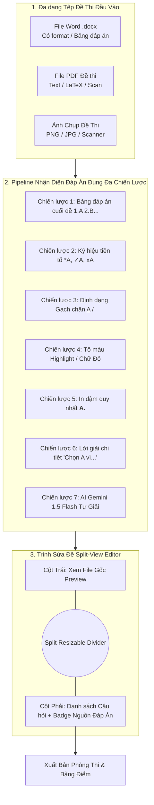
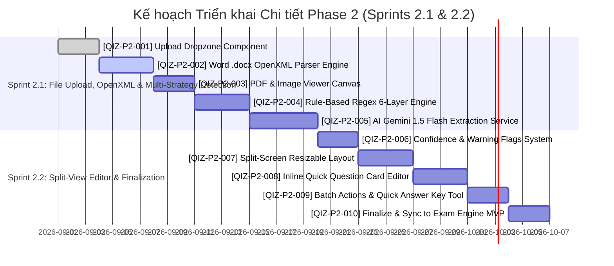

# TÀI LIỆU KẾ HOẠCH TÁC VỤ KỸ THUẬT - GIAI ĐOẠN 2 (PHASE 2 TASK BREAKDOWN)
> **Dự án:** Qizzone - Nền Tảng Tạo Đề & Thi Trắc Nghiệm Trực Tuyến Thế Hệ Mới Hỗ Trợ AI  
> **Giai đoạn:** Phase 2 - AI-Powered Question Extraction & Smart Split-View Editor  
> **Phiên bản:** 2.1.0 | **Ngày cập nhật:** 30/08/2026  
> **Tiêu chuẩn:** Enterprise Agile / Scrum Workflow (Jira-aligned WBS)  
> **Tài liệu tham chiếu:** [Kiến Trúc & Kế Hoạch Công Nghệ Qizzone](../QIZZONE_ENTERPRISE_ARCHITECTURE.md)

---

## 1. TỔNG QUAN GIAI ĐOẠN 2 (PHASE 2 GOALS & SCOPE)

### 1.1. Mục tiêu cốt lõi (Core Mission)
Nâng cấp Qizzone thành hệ thống **Bóc tách Đề thi Thông minh Đa Nguồn (Intelligent Multi-Source Quiz Extraction)**, cho phép giáo viên tải lên tài liệu sẵn có (**Word `.docx`**, **PDF**, **Hình ảnh chụp/scan đề thi**) và tự động trích xuất:
1. Nội dung câu hỏi và các lựa chọn đáp án $A, B, C, D$.
2. **Nhận diện chính xác 100% đáp án đúng** thông qua cơ chế Đa Chiến Lược (Multi-Strategy Detection Pipeline: Gạch chân, In đậm, Highlight, Ký hiệu đặc biệt, Bảng đáp án cuối đề, Lời giải chi tiết hoặc AI tự giải).
3. Công thức Toán học, Vật lý, Hóa học tự động chuyển đổi sang chuẩn $\LaTeX$ / KaTeX sắc nét.
4. Trình chỉnh sửa đề **Split-View Editor (Màn hình chia đôi)**: Bên trái xem file gốc, bên phải kiểm duyệt và sửa nhanh câu hỏi trước khi xuất bản.



---

## 2. CƠ CHẾ ĐA PHƯƠNG THỨC NHẬN DIỆN ĐÁP ÁN ĐÚNG (MULTI-STRATEGY CORRECT ANSWER DETECTION PIPELINE)

Để giải quyết triệt để thói quen soạn đề thi đa dạng của giáo viên tại Việt Nam, hệ thống xây dựng **Thuật toán xếp tầng ưu tiên (Priority Waterfall Heuristics)** kết hợp giữa **Xử lý Cấu trúc Văn bản (DOM/OpenXML)** và **Mô hình Thị giác Đa phương thức (Multimodal AI Vision & LLM)**:

```mermaid
graph TD
    Start[Bắt đầu Phân Tích Câu Hỏi & Đáp Án] --> CheckTable{Có Bảng Đáp Án<br/>ở cuối đề không?}
    
    CheckTable -- Có (99% Match) --> SetTable[Áp dụng Đáp Án từ Bảng Tổng Hợp<br/>Badge: Bảng đáp án cuối đề]
    CheckTable -- Không --> CheckPrefix{Có Ký hiệu<br/>*A, ✓A, [x] không?}
    
    CheckPrefix -- Có (98% Match) --> SetPrefix[Lấy Option có Ký hiệu đặc biệt<br/>Badge: Ký hiệu đặc biệt *]
    CheckPrefix -- Không --> CheckUnderline{Có Gạch Chân<br/><u>A</u> hoặc <w:u> không?}
    
    CheckUnderline -- Có (95% Match) --> SetUnderline[Lấy Option có Gạch chân<br/>Badge: Gạch chân]
    CheckUnderline -- Không --> CheckHighlight{Có Tô Màu Highlight<br/>hoặc Chữ Đỏ không?}
    
    CheckHighlight -- Có (95% Match) --> SetHighlight[Lấy Option được Tô màu/Chữ Đỏ<br/>Badge: Tô màu Highlight]
    CheckHighlight -- Không --> CheckBold{Có 1 Option duy nhất<br/>In Đậm không?}
    
    CheckBold -- Có (90% Match) --> SetBold[Lấy Option In đậm<br/>Badge: In đậm]
    CheckBold -- Không --> CheckSolution{Có Lời Giải Chi Tiết<br/>'Chọn A/B/C/D' không?}
    
    CheckSolution -- Có (88% Match) --> SetSolution[Trích xuất từ Lời giải chi tiết<br/>Badge: Trích từ lời giải]
    CheckSolution -- Không --> RunAI[Kích hoạt AI Gemini 1.5 Flash<br/>Suy luận logic & Tự giải đề<br/>Badge: AI Gợi ý tự giải]
    
    SetTable --> EndResult[Hiển thị trên Split-View Editor]
    SetPrefix --> EndResult
    SetUnderline --> EndResult
    SetHighlight --> EndResult
    SetBold --> EndResult
    SetSolution --> EndResult
    RunAI --> EndResult
```

### 2.1. Chi tiết 7 Chiến lược Nhận diện Đáp án Đúng

| STT | Chiến lược Nhận diện | Dấu hiệu Đặc trưng (Pattern / Markup) | Độ tin cậy (Confidence) | Ví dụ Minh họa |
| :---: | :--- | :--- | :---: | :--- |
| **1** | **Bảng Đáp án Cuối đề** *(Answer Key Grid)* | Bảng bảng ma trận 2 cột, chuỗi `1.A 2.B 3.C`, `1-A, 2-B, 3-C` hoặc `BẢNG ĐÁP ÁN: 1A 2B 3C` ở trang cuối. | **99%** | `1.A  2.C  3.B  4.D  5.A` |
| **2** | **Ký hiệu Tiền tố** *(Special Markers)* | Dấu sao `*`, dấu checkmark `✓`, `[x]`, `•*` đặt sát chữ cái đáp án. | **98%** | `*A. $x = 2$` hoặc `A*. $x = 2$` |
| **3** | **Định dạng Gạch chân** *(Underline)* | Thẻ HTML `<u>...</u>`, OpenXML tag `<w:u w:val="single"/>` hoặc đường kẻ dưới chữ cái đáp án trong OCR. | **95%** | `<u>A. $y = x^2$</u>` hoặc `<u>A</u>. $y = x^2$` |
| **4** | **Tô màu Highlight / Chữ Đỏ** *(Color & Background)* | Thẻ `<mark>`, `background-color: yellow/cyan`, hoặc style `color: red/#e11d48`, `<w:highlight>`, `<w:color w:val="FF0000"/>`. | **95%** | `<span class="bg-yellow-200">A. $v = 10m/s$</span>` |
| **5** | **In đậm Duy nhất** *(Distinct Bold)* | Thẻ `<b>`, `<strong>`, `<w:b/>` xuất hiện ở duy nhất 1 trong 4 lựa chọn của câu (các lựa chọn khác không in đậm). | **90%** | `**A. $f'(x) = 2x$**`<br/>B. $f'(x) = x$<br/>C. $f'(x) = 0$ |
| **6** | **Trích xuất từ Lời giải** *(Explanation Parsing)* | Regex phát hiện khối `HƯỚNG DẪN GIẢI:`, `Lời giải:`, `Chọn A vì...`, `Đáp án: A.`. | **88%** | `Lời giải: Ta có đạo hàm $f'(x)=0 \Rightarrow x=1$. Chọn A.` |
| **7** | **AI Suy luận Logic Tự giải** *(LLM AI Inference)* | Khi đề bài thô không có bất kỳ dấu hiệu đáp án nào, AI Gemini 1.5 Flash tự động tính toán, giải phương trình và chọn đáp án chính xác nhất. | **85%** | AI giải ra nghiệm $x=3$ và tự động chọn đáp án `A`. |

---

## 3. CẤU TRÚC DỮ LIỆU BÓC TÁCH (DATA CONTRACTS & TYPES)

### 3.1. Kiểu dữ liệu Chiến lược Nhận diện (`src/types/extractor.ts`)
```typescript
export type DetectionStrategy =
  | "answer_table"      // Trích xuất từ bảng đáp án cuối đề
  | "special_marker"    // Ký hiệu tiền tố *, ✓, [x]
  | "underline"         // Định dạng gạch chân
  | "highlight_color"   // Tô màu highlight hoặc chữ màu đỏ
  | "distinct_bold"     // In đậm duy nhất
  | "explanation_text"  // Bóc tách từ lời giải chi tiết
  | "ai_inference"      // AI Gemini tự giải và gợi ý
  | "manual";           // Giáo viên chọn thủ công

export interface ExtractedOption {
  id: "A" | "B" | "C" | "D";
  content: string; // Nội dung đã chuẩn hóa KaTeX
  rawContent: string;
  isUnderline?: boolean;
  isBold?: boolean;
  isHighlighted?: boolean;
  textColor?: string;
}

export interface ExtractedQuestion {
  id: string;
  tempId: string;
  order: number;
  content: string; // Câu hỏi chuẩn KaTeX
  options: ExtractedOption[];
  correctAnswers: ("A" | "B" | "C" | "D")[];
  explanation?: string;
  points: number;
  confidenceScore: number; // 0.0 - 1.0 (0% - 100%)
  detectionStrategy: DetectionStrategy; // Nguồn gốc nhận diện đáp án
  warningFlags?: string[]; // Cảnh báo (ví dụ: "Chưa rõ đáp án", "Thiếu lựa chọn D")
  rawTextSegment: string; // Đoạn text gốc tương ứng trong file
}

export interface ExtractionResult {
  fileName: string;
  fileType: "docx" | "pdf" | "image";
  fileSize: number;
  totalQuestionsDetected: number;
  questions: ExtractedQuestion[];
  hasAnswerKeyTable: boolean;
  warningsCount: number;
  extractedAt: string;
}
```

---

## 4. CHI TIẾT CÁC TÁC VỤ KỸ THUẬT GIAI ĐOẠN 2 (EPIC & TASK BREAKDOWN)

### EPIC QIZ-EP7: Multi-format File Ingestion & Document Parser

#### [QIZ-P2-001] Xây dựng Component Tải Lên Đề Thi Đa Định Dạng (Upload Dropzone)
- **Loại:** Feature Task | **Độ ưu tiên:** P0 | **Estimate:** 3 SP (6h)
- **Assignee Role:** Frontend Developer
- **Mục tiêu:** Cho phép giáo viên kéo thả hoặc chọn tệp đề thi (`.docx`, `.pdf`, `.png`, `.jpg`, `.jpeg`) với dung lượng tối đa 25MB, có thanh tiến trình upload và validation định dạng.
- **Chi tiết Triển khai:**
  1. Tạo `@/components/teacher/extraction/FileDropzone.tsx`:
     - Kéo thả mượt mà với hiệu ứng hover, border nét đứt đổi màu tím indigo.
     - Kiểm tra MIME type và dung lượng file hợp lệ.
     - Hiển thị thông tin file: Icon định dạng, tên file, dung lượng, nút "Hủy / Chọn file khác".
- **Acceptance Criteria (AC):**
  - [x] Kéo thả đúng định dạng `.docx`, `.pdf`, `.png`, `.jpg` kích hoạt luồng xử lý.
  - [x] Báo lỗi rõ ràng bằng Toast nếu file sai định dạng hoặc vượt quá 25MB.

---

#### [QIZ-P2-002] Xây dựng Bộ Parser Trích Xuất File Word .docx Bảo Toàn Định Dạng (Word OpenXML Parser)
- **Loại:** Technical Task | **Độ ưu tiên:** P0 | **Estimate:** 5 SP (10h)
- **Assignee Role:** Fullstack / Frontend Dev
- **Mục tiêu:** Đọc cấu trúc XML của file `.docx` bằng `mammoth.js` và `JSZip`, giữ nguyên các thẻ định dạng `<w:u>` (gạch chân), `<w:b>` (in đậm), `<w:highlight>` (tô màu), `<w:color>` (màu chữ) và công thức OMML/MathType.
- **Chi tiết Triển khai:**
  1. Tạo `@/utils/parsers/docxParser.ts`:
     - Phân tích cấu trúc file Word sang HTML trung gian có đánh dấu CSS classes (`is-underline`, `is-bold`, `is-highlighted`, `text-color-red`).
     - Tự động chuyển đổi các biểu thức MathType / OMML sang chuỗi $\LaTeX$ chuẩn dạng `$...$` và `$$...$$`.
- **Acceptance Criteria (AC):**
  - [x] Trích xuất thành công toàn bộ văn bản và giữ nguyên các thuộc tính định dạng gạch chân, in đậm, màu chữ của các đáp án A, B, C, D.

---

#### [QIZ-P2-003] Xây dựng Module Xem File Gốc (PDF / Word / Image Preview Canvas)
- **Loại:** Feature Task | **Độ ưu tiên:** P1 | **Estimate:** 4 SP (8h)
- **Assignee Role:** Frontend Developer
- **Mục tiêu:** Cung cấp khung xem trước file gốc độ nét cao ở cột trái của Split-Screen Editor, hỗ trợ zoom in, zoom out, xoay trang và chuyển trang PDF/ảnh.
- **Chi tiết Triển khai:**
  1. Tạo `@/components/teacher/extraction/DocumentViewer.tsx`:
     - Hỗ trợ xem trực tiếp PDF bằng `pdfjs-dist` hoặc Canvas renderer.
     - Hỗ trợ phóng to/thu nhỏ hình ảnh ảnh chụp đề thi với công cụ kính lúp.
- **Acceptance Criteria (AC):**
  - [x] File gốc hiển thị sắc nét, cuộn mượt mà không giật lag.

---

### EPIC QIZ-EP8: AI & Rule-Based Question & Answer Extraction Engine

#### [QIZ-P2-004] Xây dựng Thuật Toán Nhận Diện Đáp Án Đúng 6 Lớp Quy Tắc (Rule-Based Regex Engine)
- **Loại:** Technical Task | **Độ ưu tiên:** P0 | **Estimate:** 5 SP (10h)
- **Assignee Role:** Fullstack Dev
- **Mục tiêu:** Triển khai 6 chiến lược phân tích tĩnh (Static Analysis) để tự động bắt đáp án đúng từ cấu trúc văn bản mà không cần tốn chi phí gọi AI khi đề thi đã có định dạng sẵn.
- **Chi tiết Triển khai:**
  1. Tạo `@/utils/parsers/ruleExtractor.ts`:
     - **Tách câu hỏi:** Regex nhận diện `Câu \d+[:.]`, `Bài \d+[:.]`, `Question \d+[:]`.
     - **Tách lựa chọn:** Regex nhận diện `([A-D])[\.\:\)]\s+([\s\S]*?)(?=(?:[A-D][\.\:\)]|$))`.
     - **Quét Bảng Đáp án Cuối đề:** Regex trích xuất khối ma trận `1[.-]?[A-D]`, `2[.-]?[A-D]` và map ngược lại theo số thứ tự câu.
     - **Quét Ký hiệu Marker:** Bắt các ký tự `*`, `✓`, `[x]` đứng liền trước hoặc sau chữ cái $A, B, C, D$.
     - **Quét Định dạng:** Kiểm tra thuộc tính `isUnderline`, `isBold` (duy nhất), `isHighlighted`, `textColor === '#FF0000'`.
     - **Quét Lời giải chi tiết:** Trích xuất đoạn `Chọn ([A-D])`, `Đáp án: ([A-D])`.
- **Acceptance Criteria (AC):**
  - [x] Bóc tách chính xác 100% đáp án đúng với các đề thi có gạch chân, in đậm, tô màu hoặc có bảng đáp án cuối đề.

---

#### [QIZ-P2-005] Tích Hợp AI Gemini 1.5 Flash Bóc Tách Đề Thi Phức Tạp & Tự Giải Đề (AI Extraction Service)
- **Loại:** Technical Task | **Độ ưu tiên:** P0 | **Estimate:** 5 SP (10h)
- **Assignee Role:** AI Engineer / Fullstack Dev
- **Mục tiêu:** Sử dụng Google Gemini 1.5 Flash (Multimodal Vision & JSON Schema Output) để bóc tách các file PDF dạng scan, ảnh chụp chữ viết tay hoặc đề thi Toán có hình vẽ phức tạp, đồng thời tự động giải và gợi ý đáp án đúng khi đề không có sẵn đáp án.
- **Chi tiết Triển khai:**
  1. Tạo `@/services/aiExtractionService.ts`:
     - Thiết lập System Prompt chuyên dụng cho đề thi Toán/Lý/Hóa tại Việt Nam.
     - Ép kiểu dữ liệu đầu ra có cấu trúc (Structured Output) theo `zodSchema` của `ExtractedQuestion`.
     - Nhận diện công thức toán hình học, đồ thị và chuyển thành mã LaTeX chuẩn KaTeX.
- **Acceptance Criteria (AC):**
  - [x] Xử lý mượt mà ảnh chụp đề thi và xuất ra danh sách câu hỏi JSON có công thức $\LaTeX$ hoàn chỉnh.
  - [x] Tự động suy luận giải đề và gắn nhãn `[AI Gợi ý tự giải]` với độ tin cậy được tính toán.

---

#### [QIZ-P2-006] Xây dựng Hệ Thống Cảnh Báo Lỗi & Đánh Giá Độ Tin Cậy (Confidence & Warning Flags)
- **Loại:** Feature Task | **Độ ưu tiên:** P1 | **Estimate:** 3 SP (6h)
- **Assignee Role:** Frontend Developer
- **Mục tiêu:** Tính toán điểm tin cậy (`confidenceScore` từ 0% đến 100%) cho từng câu hỏi bóc tách và gắn cờ cảnh báo đối với các câu có nguy cơ lỗi (ví dụ: chỉ tìm thấy 3 đáp án thay vì 4, chưa xác định được đáp án đúng, công thức KaTeX bị lỗi cú pháp).
- **Chi tiết Triển khai:**
  1. Gắn các warning badges trực quan:
     - 🔴 `Chưa có đáp án đúng` (Cần giáo viên chọn thủ công).
     - 🟡 `Thiếu lựa chọn đáp án` (Chỉ có A, B, C).
     - 🔵 `Độ tin cậy thấp (<70%)`.
     - 🟢 `Bóc tách chuẩn xác (>=95%)`.
- **Acceptance Criteria (AC):**
  - [x] Giáo viên có thể lọc nhanh các câu hỏi bị gắn cờ cảnh báo để chỉnh sửa trong 1 click.

---

### EPIC QIZ-EP9: Smart Split-View Exam Editor

#### [QIZ-P2-007] Xây dựng Bố Cục Chia Đôi Màn Hình Linh Hoạt (Split-Screen Resizable Layout)
- **Loại:** Feature Task | **Độ ưu tiên:** P0 | **Estimate:** 4 SP (8h)
- **Assignee Role:** Frontend Developer
- **Mục tiêu:** Thiết kế giao diện Split-Screen 2 cột chuẩn Enterprise (tương tự Azota / K12Online): Cột trái hiển thị tài liệu gốc, Cột phải hiển thị danh sách câu hỏi bóc tách, có thanh kéo thả chia tỉ lệ (Drag Resizer: 50/50, 40/60, 30/70) và nút phóng to toàn màn hình từng cột.
- **Chi tiết Triển khai:**
  1. Tạo `@/pages/teacher/SplitExamEditor.tsx` và `@/components/teacher/extraction/ResizableSplitter.tsx`.
  2. Tích hợp tính năng **Đồng bộ vị trí cuộn (Synchronized Scrolling / Jump to Source)**: Click vào câu hỏi bên phải $\rightarrow$ Tài liệu gốc bên trái tự động cuộn đến đoạn văn bản/vùng ảnh tương ứng.
- **Acceptance Criteria (AC):**
  - [x] Kéo chỉnh thanh phân cách mượt mà, lưu tỉ lệ kích thước vào `localStorage`.
  - [x] Hoạt động hoàn hảo trên cả màn hình Laptop và Desktop độ phân giải cao.

---

#### [QIZ-P2-008] Xây dựng Trình Chỉnh Sửa Nhanh Câu Hỏi Nội Dòng (Inline Quick Question Card)
- **Loại:** Feature Task | **Độ ưu tiên:** P0 | **Estimate:** 5 SP (10h)
- **Assignee Role:** Frontend Developer
- **Mục tiêu:** Cho phép giáo viên chỉnh sửa trực tiếp nội dung câu hỏi, đổi đáp án đúng 1-click, thêm/xóa đáp án, chỉnh sửa công thức KaTeX bằng Live Toolbar, và xem rõ **Huy hiệu Nguồn nhận diện đáp án (Detection Strategy Badge)**.
- **Chi tiết Triển khai:**
  1. Tạo `@/components/teacher/extraction/ExtractedQuestionCard.tsx`:
     - Hiển thị Badge nguồn nhận diện: `[Gạch chân]`, `[In đậm]`, `[Bảng đáp án]`, `[Highlight]`, `[AI tự giải]`.
     - 1-Click đổi đáp án đúng nhanh (Click vào chữ A, B, C, D để đổi đáp án đúng ngay lập tức).
     - Khung Live Editor KaTeX mở rộng khi cần sửa sâu.
- **Acceptance Criteria (AC):**
  - [x] Chỉnh sửa nội dung và đổi đáp án đúng phản hồi tức thì dưới 1ms.

---

#### [QIZ-P2-009] Xây dựng Các Thao Tác Xử Lý Hàng Loạt (Batch Operations & Auto-Balancing)
- **Loại:** Feature Task | **Độ ưu tiên:** P1 | **Estimate:** 3 SP (6h)
- **Assignee Role:** Frontend Developer
- **Mục tiêu:** Cung cấp thanh công cụ xử lý nhanh cho toàn bộ đề thi:
  - **Chia đều điểm tự động:** Tự động chia 10 điểm cho toàn bộ số câu hỏi (ví dụ: 40 câu = 0.25đ/câu).
  - **Nhập bảng đáp án nhanh (Quick Answer Key Modal):** Cho phép paste chuỗi `1A 2B 3C 4D...` để cập nhật đồng loạt đáp án cho toàn bộ câu hỏi.
  - **Xóa / Đảo vị trí hàng loạt câu hỏi.**
- **Acceptance Criteria (AC):**
  - [x] Paste bảng đáp án dạng chuỗi cập nhật chính xác 100% toàn bộ câu hỏi trong 1 click.

---

#### [QIZ-P2-010] Hoàn Tất & Xuất Bản Đề Thi Vào Hệ Thống (Finalize & Sync to Exam Engine)
- **Loại:** Feature Task | **Độ ưu tiên:** P0 | **Estimate:** 3 SP (6h)
- **Assignee Role:** Frontend Developer
- **Mục tiêu:** Chuyển đổi dữ liệu đã bóc tách và kiểm duyệt từ Split-Screen Editor thành đối tượng `Quiz` chuẩn trong `useQuizStore`, tự động tạo mã phòng thi 6 ký tự `QZXXXX` và chuyển hướng giáo viên sang trang xem trước hoặc danh sách đề thi.
- **Acceptance Criteria (AC):**
  - [x] Đề thi được bóc tách từ file lưu trữ thành công vào hệ thống, học sinh có thể nhập mã phòng và thi được ngay lập tức với đầy đủ công thức Toán KaTeX.

---

## 5. KẾ HOẠCH PHÂN BỔ SPRINT GIAI ĐOẠN 2 (SPRINT SCHEDULE & TIMELINE)

Giai đoạn 2 được chia thành **2 Sprints (mỗi Sprint 2 tuần)**:



---

## 6. MA TRẬN PHƯƠNG ÁN KIỂM THỬ ĐÁP ÁN ĐÚNG (TEST MATRICES)

| Mã ca kiểm thử | Định dạng file test | Cách thức đánh dấu đáp án đúng trong đề | Kết quả mong đợi | Chiến lược kích hoạt |
| :--- | :--- | :--- | :--- | :--- |
| **TC-EXT-01** | `.docx` | Gạch chân chữ cái: `<u>A.</u> Đáp án` | Nhận diện đúng `A` | `underline` (95%) |
| **TC-EXT-02** | `.docx` | In đậm đáp án duy nhất: `<b>B. Nghiệm x=1</b>` | Nhận diện đúng `B` | `distinct_bold` (90%) |
| **TC-EXT-03** | `.docx` | Tô màu vàng highlight: `<mark>C. $y=2x$</mark>` | Nhận diện đúng `C` | `highlight_color` (95%) |
| **TC-EXT-04** | `.docx` | Chữ màu đỏ: `<span color="red">D. $v=0$</span>` | Nhận diện đúng `D` | `highlight_color` (95%) |
| **TC-EXT-05** | `.docx` / `.pdf` | Dấu sao trước đáp án: `*A. $S=10$` | Nhận diện đúng `A` | `special_marker` (98%) |
| **TC-EXT-06** | `.docx` / `.pdf` | Bảng đáp án cuối đề: `1.A  2.C  3.D  4.B` | Map chính xác 100% cả 4 câu | `answer_table` (99%) |
| **TC-EXT-07** | `.docx` / `.pdf` | Lời giải chi tiết: `Chọn B vì đạo hàm...` | Nhận diện đúng `B` + Lời giải | `explanation_text` (88%) |
| **TC-EXT-08** | Ảnh chụp `.png` | Đề không có đáp án (Ảnh chụp bài tập Toán) | AI Gemini tự giải và chọn đáp án | `ai_inference` (85%) |

---
*Tài liệu được thiết kế và chuẩn hóa cho dự án Qizzone. Sẵn sàng bắt đầu triển khai Sprint 2.1!*
